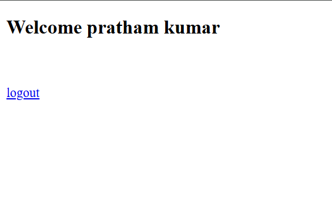

# Login and Register Application

A web application built using **Spring Boot**, **Spring Data JPA**, **PostgreSQL**, and **JSP** for user login and registration functionality.

---

## Features

- **User Registration**: New users can register by providing their details.
- **User Login**: Existing users can log in using their credentials.
- **Data Persistence**: User data is securely stored in a PostgreSQL database using Spring Data JPA.
- **Server-Side Rendering**: JSP is used for dynamic HTML generation.

---

## Tech Stack

- **Backend**: Spring Boot
- **Frontend**: JSP
- **Database**: PostgreSQL
- **ORM**: Spring Data JPA
- **Build Tool**: Maven

---

## Prerequisites

1. **Java 17** or higher
2. **Maven** for dependency management
3. **PostgreSQL** installed and running

---

## Setup and Installation

### Step 1: Clone the Repository

```bash
https://github.com/pkk01/LoginForm_JpaSB.git
cd LoginForm_JpaSB
```

### Step 2: Configure Database

1. Update the database settings in `application.properties` (located in `src/main/resources`):

```properties
spring.datasource.url=jdbc:postgresql://localhost:5432/springboot_jpa
spring.datasource.username=<your_username>
spring.datasource.password=<your_password>
spring.jpa.hibernate.ddl-auto=update
```

2. Create the database in PostgreSQL:

```sql
CREATE DATABASE springboot_jpa;
```

### Step 3: Build and Run the Application

```bash
mvn clean install
mvn spring-boot:run
```

### Step 4: Access the Application

Open your browser and navigate to:

```
http://localhost:8080/
```

---

## Project Structure

```
src
├── main
│   ├── java
│   │   └── com.pk.main
│   │       ├── controller
│   │       │   ├── LoginController.java
│   │       │   └── RegisterController.java
│   │       ├── model
│   │       │   └── User.java
│   │       ├── repository
│   │       │   └── UserRepository.java
│   │       └── Application.java
│   ├── resources
│   │   ├── templates
│   │   │   ├── login.jsp
│   │   │   └── register.jsp
│   │   ├── application.properties
│   │   └── static
│   │       └── css
│   │           └── styles.css
```

---

## Endpoints

| Endpoint       | Method | Description                  |
|----------------|--------|------------------------------|
| `/`            | GET    | Home page                   |
| `/register`    | GET    | Registration page           |
| `/register`    | POST   | Handles user registration   |
| `/login`       | GET    | Login page                  |
| `/login`       | POST   | Handles user login          |

---

## Screenshots

### Index Page


### Registration Page


### Login Page


### Profile Page



### Database


---

## Contributing

1. Fork the repository.
2. Create a new branch: `git checkout -b feature-name`.
3. Commit your changes: `git commit -m 'Add some feature'`.
4. Push to the branch: `git push origin feature-name`.
5. Submit a pull request.

---

## License

This project is licensed under the [MIT License](LICENSE).

---

## Contact

- **Name**: Pratham Kumar
- **Email**: prk61dlw@gmail.com
- **GitHub**: [github.com/pkk01](https://github.com/pkk01)

Feel free to reach out with any questions or feedback!

